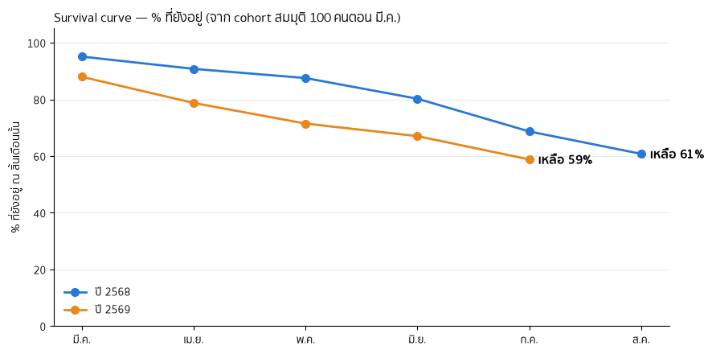
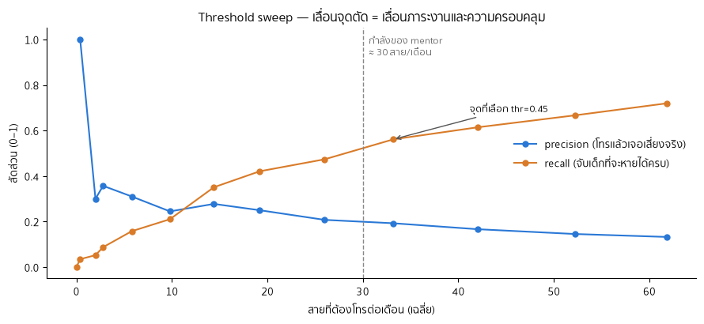
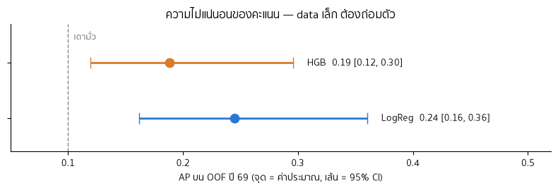
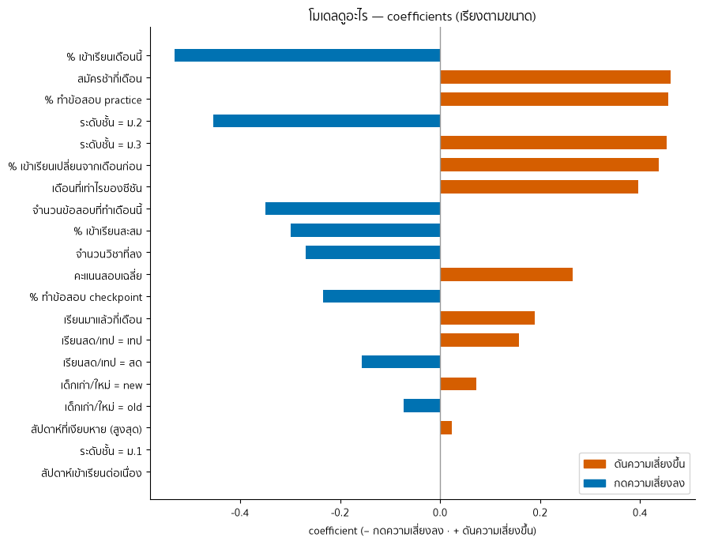

# Student Churn Early-Warning — Online Tutoring Business

Predicting which students are at risk of cancelling their monthly subscription at a Thai online tutoring school (~660 students/season), so mentors can reach out **before** the cancellation happens.

I run this business. The model was built on our real operational data (attendance, exam checkpoints, engagement, payment timing) — and this public repo runs entirely on a **synthetic sample dataset** so that no real student data ever leaves the company.

Why I built this project:

1. I wanted to use the Python, pandas, and scikit-learn skills I taught myself on a real project.
2. I wanted to solve a real problem in my company: why do students cancel our classes? Instead of just guessing, I use a model to help predict who is at risk — so we can take care of them before they cancel, and keep more students with us.


## Honest results (on real data)

| Metric | Value |
|---|---|
| Average Precision | 0.213 |
| Precision@30 — model | 0.240 |
| Precision@30 — existing "tier" heuristic | **0.273** |

**The model lost to our existing human-designed tier heuristic** on the metric that matters operationally (precision in the top-30 list our mentors can actually call each month). 

To me, the most important things I learned from this project:
1. I now know how to build a model in the real world — I went through the whole process myself, from gathering data to deployment 
2. My model may not beat "tier" (our previous method for predicting cancellations), but it helps me see risky student behavior that I could not see on my own — the model can.


## A few pictures (generated from the synthetic sample in this repo)

| | |
|---|---|
|  |  |
| *Survival curve — of the students who started in March, how many are still with us each month* | *Threshold sweep — we pick the cutoff where our mentors' call capacity (~30 a month) sits* |
|  |  |
| *Logistic Regression vs a more complex model — the confidence intervals overlap, so we keep the simpler one* | *What the model pays attention to (logistic regression coefficients)* |


> Numbers in these charts come from the **synthetic** dataset; the headline results table above is from the real (private) data.

## Reproduce (3 commands)

```bash
python3 -m venv venv && ./venv/bin/pip install -r requirements.txt
bash scripts/run_all.sh          # executes every notebook on the synthetic sample
./venv/bin/python scripts/smoke_test.py
```

## Repo structure

```
notebooks/       ch00–ch08: setup → labels → wrangling → EDA → features → model
                 → validation → interpretation → deploy (executed on sample data)
src/             config, schema contracts, shared feature/label builders, checkers
data/sample/     synthetic dataset (seeded generator: src/make_synthetic.py)
scoring/         monthly scoring script (production shape)
solutions/       per-exercise answer keys (course scaffolding)
docs/            data dictionary, course guide
```

## How this was built — and what is mine

This project is a structured, exercise-driven course **built with AI assistance (Claude) acting as the tutor**: the scaffolding, auto-checkers, and answer keys were AI-generated around my real business problem and my real data.

## Chapter by chapter — what I did, what I learned, what AI did

I am a beginner programmer. I took this course with Claude as my tutor.
My rule was simple: really learn the main tools — the pandas functions I need
and basic scikit-learn — and let AI do the heavy technical work.

**ch00 — Setup and data:** I gathered student data from two seasons: 2568 from
Google Sheets and LINE chat records, and 2569 from Supabase, the database behind
our Eduwise platform. The data covers student profiles, attendance, exam attempts,
and cancellations. AI helped me design the data structure.

**ch01 — Labels:** Claude taught me how to build labels from the data we have,
and when a month must be marked NaN (unknown) instead of guessing. I learned the
pandas tools for preparing data: loc, iloc, groupby, and set_index.

**ch02 — Combining the data:** This chapter combines two years of data with
different formats into one schema — for example, turning wide tables into long
format. I relied on AI heavily here: AI built the cleaning steps, and I filled in
the data decisions in the real assembly — which students to keep, which attendance
file to use, and checking the churn count.

**ch03 — EDA:** I explored the data myself to look for insights: monthly and
yearly churn rate with pivot tables, and whether behaviour such as attendance is
linked to churn, using sort_values, groupby, and merge. I did this EDA on my own
data before building any model.

**ch04 — Feature engineering:** This chapter builds extra features from the data
we already have, to give the model more to learn from. For example, we have weekly
attendance, so AI suggested features like cumulative attendance % and the change in
attendance this month vs last month. The pandas code and AI-written helper functions
here were quite complex and technical, so I skipped the exercises and learned from
the answer keys instead.

**ch05 — First model:** This is where I trained a real model: Logistic Regression
inside a scikit-learn Pipeline, with an imputer, a scaler, and one-hot encoding
before training. Then I measured precision, recall, and the precision-recall (AP)
curve, and compared the model against random guessing.

**ch06 — Validation:** I practised validating the model and learned where our data
is weak. With a random split, the model can train on the future and be tested on
the past, so it "remembers" instead of predicts — so I used expanding-window
validation instead. I also ran bootstrap confidence intervals, because our data is
small and the AP score moves around a lot; a CI shows how much to trust it.

**ch07 — Model interpretation:** I looked at the model's coefficients and
permutation importance to see which features really matter, and which only look
important. Then I built a summary of the top-3 reasons for each student, written
as plain sentences the team can read.

**ch08 — Deploy:** This chapter is very technical and not my focus, so AI did all
of it. The model is deployed on EWT Task, our company's internal website. I designed
the UI I wanted, so the team can actually use the model's output.

## Deployment update

Since 30 August 2026 the model runs in production on EWT Task, our internal
website. Every Monday it pulls the latest attendance and exam data from Eduwise,
scores all active students, and shows mentors a ranked list with the top-3 reasons
for each student in plain Thai. Mentors log their follow-up calls on the same page.

Because the model did not beat our tier heuristic in validation, the tier list stays
the primary tool and the model list is a supplement. We will retrain and compare
both at the end of season 2569.
